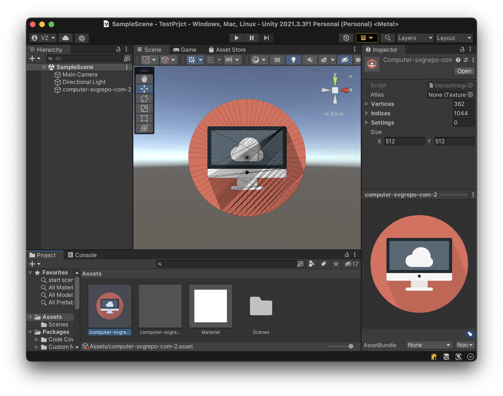
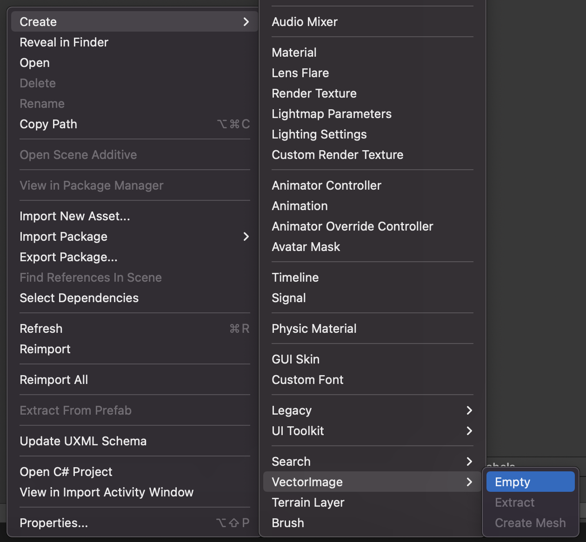
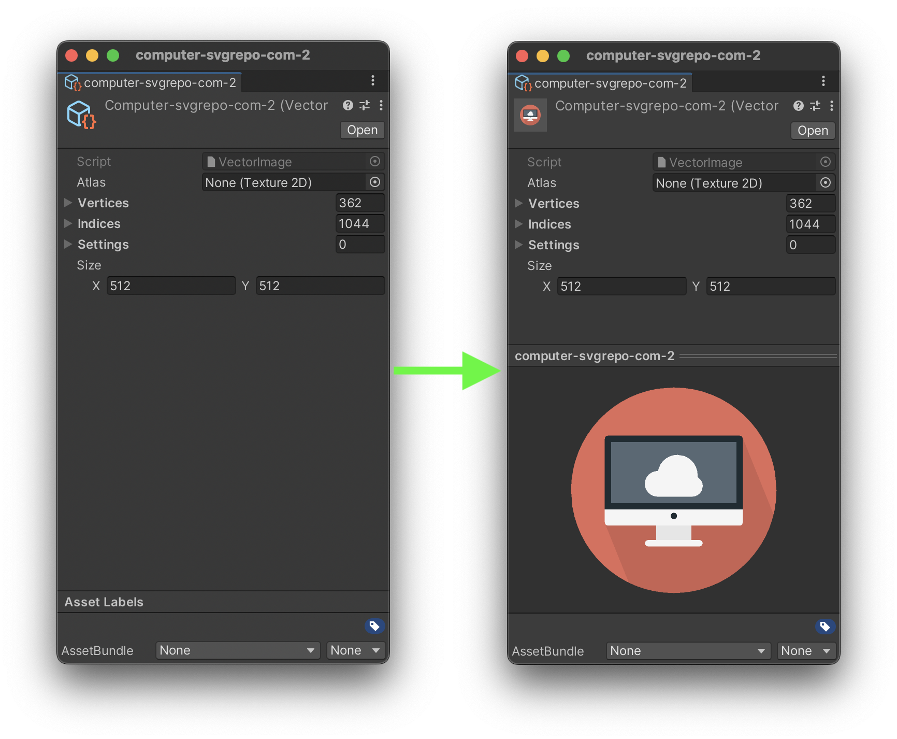

#Vector Image Utils



###Main features
1) Create VectorImage from editor and manipulate from code.
2) Preview for VectorImage in Inspector and Project tabs.
3) Create Mesh from VectorImage for using in scene.

###Create
All menu is accessible from create menu:


###Get and Set values from code

```c#
VectorImage Copy(VectorImage vi)
{
    VectorImage image = ScriptableObject.CreateInstance<VectorImage>();
    image.SetVertices(vi.GetVertices());
    image.SetIndexes(vi.GetIndexes());
    image.SetAtlas(vi.GetAtlas());
    image.SetSize(vi.GetSize());
    return image;
}
```
###Preview
